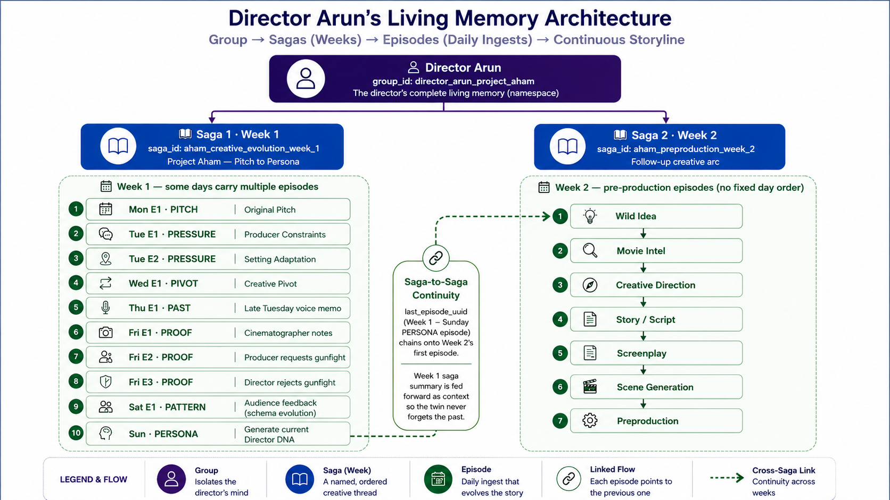
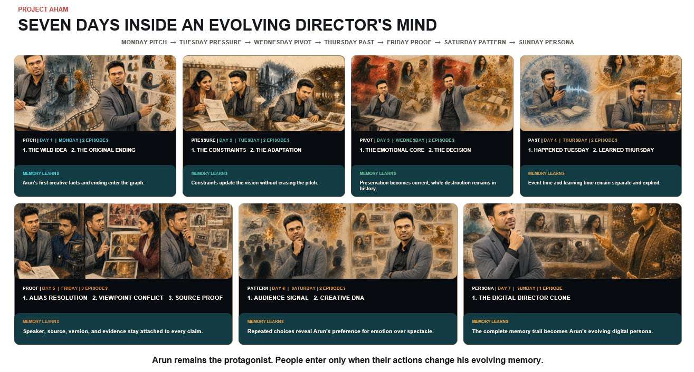

# When Agents Meet Living Graphs: Building an Agentic Movie Intelligence

*What happens when a one-line story is handed to an entire AI pre-production crew?*

## Session Overview
In this session, we will build an agentic creative studio where specialised agents for movie intelligence, creative direction, scriptwriting, screenplay development, visual storyboarding, and memory work together to transform a raw idea into a cinematic storyboard and a production plan.
At its core is a living, bi-temporal knowledge graph that captures every idea, approval, rejection, revision, and creative preference of the director. Instead of starting from zero in every session, the agents learn how the creator thinks and become more context-aware with every project.
This is Human × AI in action: the human owns the creative vision, agents coordinate the work, a movie knowledge graph grounds recommendations, and living graph memory preserves the intelligence created along the way. 

## Key Takeaways
### Living Knowledge Graphs
Understand how knowledge graphs can evolve continuously through documents, external intelligence, agent findings, generated artifacts, human feedback, and decisions.
### Agentic Graph Memory
Learn how graph memory can represent more than conversation history by connecting ideas, evidence, agents, actions, scenes, versions, decisions, and human approvals.
### Multi-Agent Interoperability
See how specialised agents can collaborate, challenge one another, exchange structured artifacts, and provide consulting support across a complex workflow.
### Human-in-the-Loop Agent Systems
Learn how to position humans as active decision-makers and governors rather than passive prompt providers.
### Agentic Operating Layer
Understand how LangGraph can coordinate agents, tools, memory, external data, approvals, interruptions, and long-running stateful workflows.
### Movie Intelligence and Creative Grounding
See how ratings, reviews, overviews, genres, themes, audience sentiment, and internet research can improve creative judgment without copying existing movies.

## Final Outcome
By the end of this hack session, participants will understand how to build more than a multi-agent content-generation pipeline.
They will see how to build a Living Agentic Knowledge System in which:
* Agents research and create
* Agents consult other agents
* Humans guide and approve
* Tools connect to external intelligence
* Knowledge graphs connect every artifact and decision
* Graph memory preserves continuity
* New feedback changes the active state of the system
* The complete process remains transparent and explainable

It is a practical demonstration of how Living Knowledge Graphs, Agentic Graph Memory, specialised agents, and humans can come together to form the Agentic Operating Layer.

**Join me to see how a wild one-line idea transforms to a cinematic storyboard: six agents, one living graph, and one human firmly in the director’s chair.**
